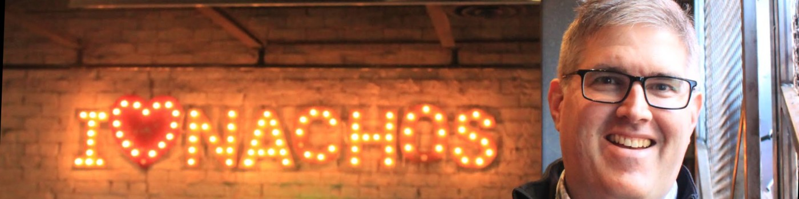

<h1 align="center">Benjamin Williams :wave:</h1>

<h2>:factory: I'm currently working on a few things:</h2>

Relaunching <a href="http://nachopowerrankings.com">NachoPowerRankings.com</a>

I have a love of nachos that inspired me around 2015-2016 to create a nacho power rankings website.  I had devised a rating scale that factored in multiple criteria to try to objectively determine where the best place for nachos were in Columbus.  At that time Condado Tacos was on top of the leaderboard with their $5 bowl of nachos, but a post pandemic reset needs to occur.  I also want to leverage my own skills for web development instead of using WordPress.

## Maintaining this site is what gave me some confidence that I knew what I was doing with web development; helping convince me that I was capable of going into software development for my second career.

Figuring out how to leverage <a href="https://github.com/features/codespaces">Github CodeSpaces</a> to make the process of learning how to be a professional developer more accessable to all.

Looking for my next professional position.

